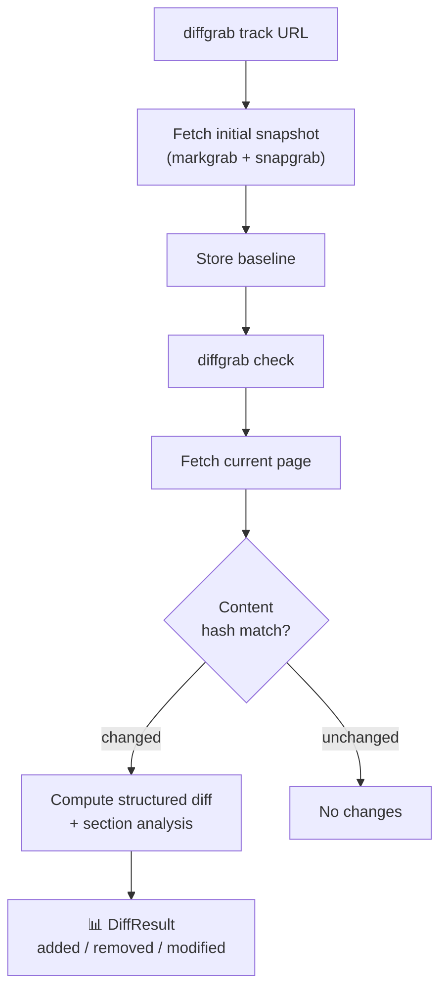

# diffgrab

[](https://pypi.org/project/diffgrab/)
[](https://pypi.org/project/diffgrab/)
[](https://github.com/QuartzUnit/diffgrab/blob/main/LICENSE)

> [한국어 문서](README.ko.md) · [llms.txt](llms.txt)

> Web page change tracking with structured diffs. markgrab + snapgrab integration, MCP native.

```python
from diffgrab import DiffTracker

tracker = DiffTracker()
await tracker.track("https://example.com")
changes = await tracker.check()
for c in changes:
    if c.changed:
        print(c.summary)     # "3 lines added, 1 lines removed in sections: Introduction."
        print(c.unified_diff) # Standard unified diff output
await tracker.close()
```

## Features

- **Change detection** — track any URL, detect content changes via content hashing
- **Structured diffs** — unified diff + section-level analysis (which headings changed)
- **Human-readable summaries** — "5 lines added, 2 removed in sections: Intro, Methods"
- **Snapshot history** — SQLite storage, browse past versions of any page
- **markgrab powered** — HTML/YouTube/PDF/DOCX extraction via [markgrab](https://github.com/QuartzUnit/markgrab)
- **Visual diff** — optional screenshot comparison via [snapgrab](https://github.com/QuartzUnit/snapgrab)
- **MCP server** — 5 tools for Claude Code / MCP clients
- **CLI included** — `diffgrab track`, `check`, `diff`, `history`, `untrack`

## How It Works



## Install

```bash
pip install diffgrab
```

Optional extras:

```bash
pip install 'diffgrab[cli]'      # CLI with click + rich
pip install 'diffgrab[visual]'   # Visual diff with snapgrab
pip install 'diffgrab[mcp]'      # MCP server with fastmcp
pip install 'diffgrab[all]'      # Everything
```

## Usage

### Python API

```python
import asyncio
from diffgrab import DiffTracker

async def main():
    tracker = DiffTracker()

    # Track a URL (takes initial snapshot)
    await tracker.track("https://example.com", interval_hours=12)

    # Check for changes
    changes = await tracker.check()
    for change in changes:
        if change.changed:
            print(change.summary)
            print(change.unified_diff)

    # Get diff between specific snapshots
    result = await tracker.diff("https://example.com", before_id=1, after_id=2)

    # Browse snapshot history
    history = await tracker.history("https://example.com", count=20)

    # Stop tracking
    await tracker.untrack("https://example.com")

    await tracker.close()

asyncio.run(main())
```

### Convenience Functions

```python
from diffgrab import track, check, diff, history, untrack

await track("https://example.com")
changes = await check()
result = await diff("https://example.com")
snaps = await history("https://example.com")
await untrack("https://example.com")
```

### CLI

```bash
# Track a URL
diffgrab track https://example.com --interval 12

# Check all tracked URLs for changes
diffgrab check

# Check a specific URL
diffgrab check https://example.com

# Show diff between snapshots
diffgrab diff https://example.com
diffgrab diff https://example.com --before 1 --after 3

# View snapshot history
diffgrab history https://example.com --count 20

# Stop tracking
diffgrab untrack https://example.com
```

### MCP Server

Add to your Claude Code MCP config:

```json
{
  "mcpServers": {
    "diffgrab": {
      "command": "diffgrab-mcp",
      "args": []
    }
  }
}
```

Or with uvx:

```json
{
  "mcpServers": {
    "diffgrab": {
      "command": "uvx",
      "args": ["--from", "diffgrab[mcp]", "diffgrab-mcp"]
    }
  }
}
```

**MCP Tools:**

| Tool | Description |
|------|-------------|
| `track_url` | Register a URL for change tracking |
| `check_changes` | Check tracked URLs for changes |
| `get_diff` | Get structured diff between snapshots |
| `get_history` | Browse snapshot history |
| `untrack_url` | Stop tracking a URL |

## DiffResult

Every diff operation returns a `DiffResult`:

```python
@dataclass
class DiffResult:
    url: str                           # The tracked URL
    changed: bool                      # Whether content changed
    added_lines: int                   # Lines added
    removed_lines: int                 # Lines removed
    changed_sections: list[str]        # Markdown headings with changes
    unified_diff: str                  # Standard unified diff
    summary: str                       # Human-readable summary
    before_snapshot_id: int | None     # DB ID of older snapshot
    after_snapshot_id: int | None      # DB ID of newer snapshot
    before_timestamp: str              # When older snapshot was taken
    after_timestamp: str               # When newer snapshot was taken
```

## Storage

Snapshots are stored in SQLite at `~/.local/share/diffgrab/diffgrab.db` (auto-created). Custom path:

```python
tracker = DiffTracker(db_path="/path/to/custom.db")
```

## QuartzUnit Ecosystem

| Package | Role | PyPI |
|---------|------|------|
| [markgrab](https://github.com/QuartzUnit/markgrab) | HTML/YouTube/PDF/DOCX to markdown | `pip install markgrab` |
| [snapgrab](https://github.com/QuartzUnit/snapgrab) | URL to screenshot + metadata | `pip install snapgrab` |
| [docpick](https://github.com/QuartzUnit/docpick) | OCR + LLM document extraction | `pip install docpick` |
| [feedkit](https://github.com/QuartzUnit/feedkit) | RSS feed collection | `pip install feedkit` |
| **diffgrab** | **Web page change tracking** | `pip install diffgrab` |
| [browsegrab](https://github.com/QuartzUnit/browsegrab) | Browser agent for LLMs | Coming soon |

## Used in

- [newswatch](https://github.com/QuartzUnit/newswatch) — RSS news monitoring pipeline (feedkit → markgrab → embgrep → diffgrab)
- [watchdeck](https://github.com/QuartzUnit/watchdeck) — Web page monitoring with visual diffs and safety guards

## License

[MIT](LICENSE)

<!-- mcp-name: io.github.QuartzUnit/diffgrab -->
